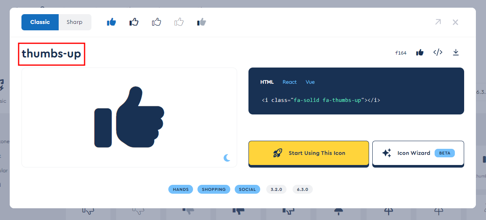
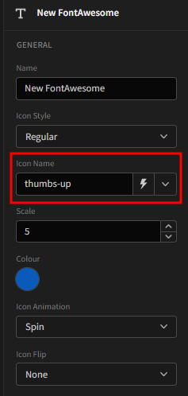

# Budibase Font Awesome (Free/Pro)
### Current Library Version: 6.2.1
A Budibase component plugin to display any icon in the Font Awesome library, in either Thin, Light, Regular, or Solid types.

# Description
Find out more about [Budibase](https://github.com/Budibase/budibase).


To view the full Font Awesome library:
  * [Free Library](https://fontawesome.com/search?m=free&o=r)
  * [Pro Library](https://fontawesome.com/search)

# How To Use
1. Import the plugin into your budibase instance (see Budibase documentation for more info)

2. Add the Font Awesome component to your application

3. Find your desired icon from the [Font Awesome library](https://fontawesome.com/icons)

4. Copy the icon name by clicking on the icon header

> 

5. Paste the name of the icon into the icon field in your component settings

> 

6. You can configure other settings such as pulse or spin animation (good for loaders or progress indication), colour, and scale.


**Note: Not all icons are available in the free library!**


# Font Awesome Pro
This plugin can also be built with support for the full Font Awesome Pro library, using your own Font Awesome Pro license.
Learn more about [Font Awesome Pro](https://fontawesome.com/plans).

## Building Font Awesome Pro
1. Clone the repository


2. Create a `.npmrc` file in the root of the plugin directory.
   * NOTE: See [this link](https://fontawesome.com/docs/web/setup/packages#set-up-npm-token-for-a-specific-project) for how to configure your .npmrc file


3. Open `package.json` and remove the following dependencies:
   * `"@fortawesome/free-solid-svg-icons": "^6.2.1"`
   * `"@fortawesome/free-regular-svg-icons": "^6.2.1"`


4. Add the following dependencies
   * `"@fortawesome/pro-light-svg-icons": "^6.2.1"`
   * `"@fortawesome/pro-regular-svg-icons": "^6.2.1"`
   * `"@fortawesome/pro-solid-svg-icons": "^6.2.1"`
   * `"@fortawesome/pro-thin-svg-icons": "^6.2.1"`


5. Update dependencies by running `npm install`


6. In `schema.json`, change the following line
   * `"options": ["Solid", "Regular"],` => `"options": ["Solid", "Regular", "Light", "Thin"],`


7. In `src/Component.svelte`:
   * Comment out the free dependencies and uncomment the pro dependencies
   * Uncomment the `Light` and `Thin` styles in the IconStyle switch statement (around line 35)


8. (Optional) Change the version number in `package.json` have pro, rather than free.


9. Build the plugin: `budi plugins --build`

# Local build instructions
To build your new  plugin run the following in your Budibase CLI:
```
budi plugins --build
```

